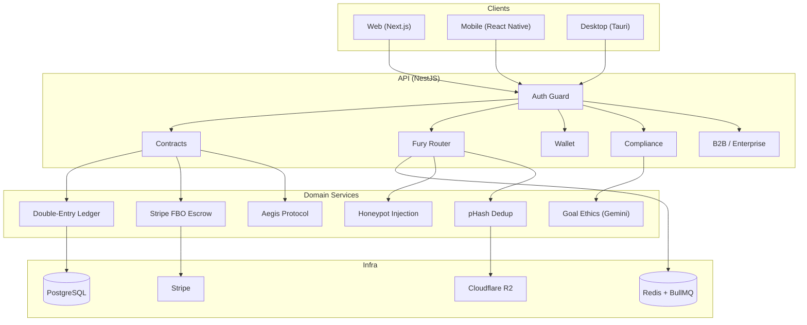

# Styx: The Blockchain of Truth

A peer-audited behavioral market that uses loss aversion (coefficient 1.955) to enforce habit follow-through via financial stakes.


---

## Table of Contents

- [Quick Start](#quick-start)
- [Architecture](#architecture)
- [Live Status](#live-status)
- [Key Features](#key-features)
- [Testing](#testing)
- [Commands](#commands)
- [API Documentation](#api-documentation)
- [Environment](#environment)
- [CI Pipeline](#ci-pipeline)
- [Security](#security)

## Quick Start

```bash
# Prerequisites: Node.js >= 20, npm 10+, PostgreSQL, Redis

# Configure runtime values for this environment
cp .env.example .env

# Install dependencies across all workspaces
npm install

# Run database migrations
npm run dev:migrate

# Run the local application stack (API + Web)
npm run dev
```

`DATABASE_URL`, `REDIS_URL`, `STYX_API_PUBLIC_URL`, `STYX_WEB_PUBLIC_URL`, and `NEXT_PUBLIC_API_URL` define the runtime endpoints. Docker Compose uses the `STYX_DOCKER_*` variables from the same environment contract.

## Architecture

Turborepo monorepo with **npm** workspaces. Package scope: `@styx/*`.

| Workspace     | Package         | Stack                                 | Role                                           |
| ------------- | --------------- | ------------------------------------- | ---------------------------------------------- |
| `src/api`     | `@styx/api`     | NestJS 11, BullMQ, Stripe, PostgreSQL | Backend — ledger, escrow, Fury Router, oracles |
| `src/web`     | `@styx/web`     | Next.js 16, React 18, Tailwind        | Dashboard, Fury workbench                      |
| `src/mobile`  | `@styx/mobile`  | React Native 0.81                     | Sensor bridge, camera, biometrics              |
| `src/desktop` | `@styx/desktop` | Tauri 2.0, Vite, React                | "The Judge" admin dashboard                    |
| `src/shared`  | `@styx/shared`  | TypeScript                            | Constants, types, algorithms                   |
| `src/pitch`   | `@styx/pitch`   | Vite, React 18, p5.js                 | Interactive pitch deck                         |



### Tech Stack

- **Runtime**: Node.js 20+
- **Package Manager**: npm (workspaces + Turborepo)
- **Database**: PostgreSQL 15 (double-entry ledger with ACID)
- **Queue**: Redis 7 + BullMQ (Fury Router)
- **Payments**: Stripe (FBO escrow — hold/capture/cancel)
- **Storage**: Cloudflare R2 (zero-egress media hosting)
- **AI**: Gemini 2.5 Flash (goal ethics screening, VC questions, ELI5)
- **Logging**: Pino (structured JSON in production, pretty-print in dev)
- **Security**: Helmet, rate limiting, JWT auth, geofencing
- **CI/CD**: GitHub Actions (test + build + lint + gates + CodeQL + E2E)
- **IaC**: Terraform (Render services, Cloudflare R2, WAF rules)
- **API Docs**: OpenAPI/Swagger at `/api/docs`

## Live Status

| Surface | URL | Status |
|---|---|---|
| Pitch deck (canonical Pages artifact, `@styx/pitch` → `docs/`) | https://a-organvm.github.io/peer-audited--behavioral-blockchain/ | `ship-now` (200 OK) |
| Interactive launch surface (waitlist / sign-up) | `/launch` | `ship-soon` (404 — tracked in Phase Gamma) |
| Ask Styx LLM Q&A app | `/ask-styx` (deploy-ask-styx workflow) | separate sub-path, not on canonical URL |
| API (NestJS, Render) | `$API_URL` per Render blueprint (`render.yaml`, `@styx/api`) | `ship-soon` (cut `v*` tag to trigger [`deploy.yml`](.github/workflows/deploy.yml); set Render secrets `RENDER_API_SERVICE_ID`, `RENDER_API_KEY`, `RENDER_WEB_SERVICE_ID`, `API_URL`, `WEB_URL`, `DATABASE_URL`) |
| Web (Next.js, Render) | `$WEB_URL` per Render blueprint (`render.yaml`, `@styx/web`) | `ship-soon` (same tag-triggered deploy as API) |

Full activation ledger (evidence, blockers, reconciliation with the cross-system `activation-ledger-2026-06-10.csv`): [`docs/activation/activation-ledger--peer-audited--2026-06-11.md`](docs/activation/activation-ledger--peer-audited--2026-06-11.md).

Verify the live surface (re-runnable by any user):

```bash
# Pitch deck
curl -sS -o /dev/null -w "%{http_code} %{url_effective}\n" \
  -L https://a-organvm.github.io/peer-audited--behavioral-blockchain/

# API health (after deploy)
# curl -sS $API_URL/health

# Web (after deploy)
# curl -sS -o /dev/null -w "%{http_code}\n" $WEB_URL
```

**Expected output:** `200 https://a-organvm.github.io/peer-audited--behavioral-blockchain/`

### Deploying

A production deploy requires:

1. **Render secrets** set in GitHub Actions: `RENDER_API_SERVICE_ID`, `RENDER_API_KEY`, `RENDER_WEB_SERVICE_ID`, `API_URL`, `WEB_URL`, `DATABASE_URL`
2. **A `v*` tag** pushed to `main` — triggers [`deploy.yml`](.github/workflows/deploy.yml) which deploys API + Web to Render, runs migrations, and smoke-tests both services.
3. **Render dashboard** manual secrets for `sync: false` vars in `render.yaml` (`STRIPE_SECRET_KEY`, `JWT_SECRET`, `CLOUDFLARE_R2_*`, etc.)

See [`docs/activation/activation-ledger--peer-audited--2026-06-11.md`](docs/activation/activation-ledger--peer-audited--2026-06-11.md) for the full activation checklist.

## Key Features

- **Double-Entry Ledger** — Every financial transaction is a balanced debit/credit pair. No phantom money.
- **Fury Peer Review** — Anonymous auditors verify proof submissions via BullMQ queue. Consensus engine aggregates verdicts.
- **Bounty Economy** — Furies earn bounties for correct verdicts and pay penalties for false accusations or honeypot failures.
- **Hash-Chained Audit Log** — SHA-256 linked event log for tamper-evident history.
- **Honeypot Injection** — System injects known-fail proofs to QA reviewer accuracy.
- **Aegis Protocol** — BMI floor (18.5), 2% weekly loss velocity cap, weekend multipliers for predictable vulnerability windows.
- **Geofencing** — Jurisdiction-based tier restrictions by US state (FULL_ACCESS / RESTRICTED / PROHIBITED).
- **Linguistic Cloaker** — Runtime vocabulary swap (stake/vault, bet/commitment) for App Store compliance.
- **Integrity Scoring** — `Base(50) + 5/completion - 15/fraud - 20/strike - 1/inactive_month`. Score determines financial tier access.
- **Goal Ethics Screening** — Gemini 2.5 Flash content policy check on user-submitted goals.
- **Identity Verification** — KYC/age verification via Stripe Identity (production) or mock adapter (dev).

## Testing

**1,107 tests** across all workspaces (Jest + ts-jest) plus Playwright E2E.

```bash
make test                                        # All unit/integration tests via Turborepo
cd src/api && npx jest                           # API tests only (640)
cd src/mobile && npx jest                        # Mobile tests only (273)
cd src/web && npx jest                           # Web tests only (166)
cd src/desktop && npx jest                       # Desktop tests only (128)
npx jest --testNamePattern="should reject"       # Single test by name

# E2E (Playwright)
make test-e2e                                    # Headless (chromium + firefox)
make test-e2e-ui                                 # Interactive UI mode
npm run test:e2e:headed                          # Headed browser
```

### Validation Gates

```bash
npx tsx scripts/validation/01-phantom-money-check.ts     # Ledger balance integrity
npx tsx scripts/validation/02-simulator-spoof-check.ts    # Oracle spoof detection
npx tsx scripts/validation/03-the-full-loop.ts            # End-to-end contract lifecycle
bash scripts/validation/04-redacted-build-check.sh        # Production vocabulary sweep
npx tsx scripts/validation/05-behavioral-physics-check.ts  # Algorithm constant validation
node scripts/validation/07-claim-drift-check.js           # Claim drift detection
```

### Beta Readiness

```bash
# Beta profile (default)
BETA_API_URL=https://api-beta.example.com npm run beta:readiness

# Staging profile
READINESS_PROFILE=staging \
STAGING_API_URL=https://api-staging.example.com \
npm run beta:readiness
```

This writes `artifacts/beta-readiness-summary.json` with gate-level `passed`/`failed`/`skipped` statuses.
Full policy and gate ownership live in `docs/planning/beta-readiness-contract.md`.

## Commands

| Command                         | Description                                              |
| ------------------------------- | -------------------------------------------------------- |
| `make install`                  | Install all workspace dependencies                       |
| `make dev`                      | Run API + Web with repo-root env resolution              |
| `make dev-turbo`                | Run the full Turbo dev pipeline                          |
| `make build`                    | Build all workspaces                                     |
| `make test`                     | Run all unit/integration tests                           |
| `make test-e2e`                 | Run Playwright E2E tests                                 |
| `npm run dev`                   | Run API + Web with repo-root env resolution              |
| `npm run dev:api`               | Run API with repo-root env resolution                    |
| `npm run dev:web`               | Run Web with repo-root env resolution                    |
| `npm run dev:migrate`           | Run database migrations with repo-root env resolution    |
| `make docker-up`                | Start services through Docker Compose                    |
| `npx turbo run lint`            | TypeScript strict lint                                   |
| `npm run format`                | Prettier across all workspaces                           |
| `npm run clean`                 | Clean build artifacts + node_modules                     |
| `npm run beta:readiness`        | Run Phase 1 beta readiness contract + emit JSON artifact |
| `cd src/api && npm run migrate` | Run database migrations via the repo-root env resolver   |
| `bash scripts/setup.sh`         | Full bootstrap (docker + install + build + test)         |

## API Documentation

Interactive Swagger/OpenAPI docs are available at `/api/docs` when the API is running:

```bash
npm run dev:api
# Open $STYX_API_PUBLIC_URL/api/docs
```

## Environment

Copy `.env.example` to `.env` and set:

| Variable                                | Required                                           | Description                                                             |
| --------------------------------------- | -------------------------------------------------- | ----------------------------------------------------------------------- |
| `STRIPE_SECRET_KEY`                     | Yes                                                | Stripe API secret key                                                   |
| `STRIPE_PUBLISHABLE_KEY`                | Yes                                                | Stripe publishable key                                                  |
| `DATABASE_URL`                          | Yes                                                | PostgreSQL connection string                                            |
| `REDIS_URL`                             | Yes                                                | Redis connection string                                                 |
| `STYX_API_PUBLIC_URL`                   | Yes                                                | Public API base URL for this environment                                |
| `STYX_WEB_PUBLIC_URL`                   | Yes                                                | Public web base URL for this environment                                |
| `NEXT_PUBLIC_API_URL`                   | Yes                                                | Web-visible API base URL                                                |
| `NEXT_PUBLIC_WEB_URL`                   | No                                                 | Web-visible canonical web URL when different from `STYX_WEB_PUBLIC_URL` |
| `CLOUDFLARE_R2_ACCESS_KEY`              | Yes                                                | R2 storage access key                                                   |
| `CLOUDFLARE_R2_SECRET_KEY`              | Yes                                                | R2 storage secret key                                                   |
| `JWT_SECRET`                            | Yes (prod)                                         | JWT signing secret (enforced in production)                             |
| `STYX_API_KEY_PEPPER`                   | Yes                                                | HMAC pepper for stored user API-key hashes                              |
| `GEMINI_API_KEY`                        | No                                                 | Gemini AI for goal ethics screening                                     |
| `KYC_ENFORCEMENT_ENABLED`               | No                                                 | Enable KYC gating (default: `false`)                                    |
| `GEOFENCE_FAIL_OPEN_ON_MISSING_HEADERS` | No                                                 | Fail-open when geo headers missing (default: `true`)                    |
| `BETA_API_URL`                          | No (required for full beta readiness verification) | Target API URL for `npm run beta:readiness`                             |
| `BETA_WEB_URL`                          | No                                                 | Optional target web URL for beta readiness                              |
| `BETA_ENV_LABEL`                        | No                                                 | Expected environment label for `/meta/release` (default: `beta`)        |

The API loads env files through `src/api/src/config/env-path.ts` in this order:
repo `.env.local`, repo `.env`, `src/api/.env.local`, then `src/api/.env`.
Set `STYX_API_KEY_PEPPER` in the selected file or deployment secret store before
issuing or verifying API keys. Generate it with `openssl rand -base64 48`; do not
reuse `JWT_SECRET`.

User API keys are issued from an authenticated session:

```bash
curl -X POST "$STYX_API_PUBLIC_URL/auth/api-keys" \
  -H "Authorization: Bearer $JWT" \
  -H "Content-Type: application/json" \
  -d '{"name":"automation","expiresInDays":90}'
```

The `apiKey` field is returned once. Use it on protected API endpoints with:

```bash
curl "$STYX_API_PUBLIC_URL/users/me" -H "x-api-key: $STYX_API_KEY"
```

## CI Pipeline

`.github/workflows/ci.yml` runs on every push and PR:

1. **Install + Security Audit** — `npm ci`, `npm audit --audit-level=high`
2. **Tests** — `turbo run test`
3. **Build** — `turbo run build` (all workspaces)
4. **Lint** — `turbo run lint` (strict TypeScript)
5. **Gate 04** — Redacted build check (no gambling terminology in production)
6. **Gate 06** — Security invariant check (no hardcoded secrets)
7. **Gate 07** — Claim drift detection
8. **Beta Readiness** — `npm run beta:readiness` (strict target enforcement in CI) + upload `artifacts/beta-readiness-summary.json`
9. **Terraform** — `terraform fmt -check`, `terraform validate`
10. **E2E** — Playwright (chromium + firefox matrix)
11. **CodeQL** — JS/TS static analysis

## Security

See [SECURITY.md](.github/SECURITY.md) for vulnerability disclosure policy and security controls.

## License

MIT. See [LICENSE](LICENSE) for details.

<!-- SYSTEM-NAV-START -->

---

<sub>[Portfolio](https://4444j99.github.io/portfolio/) · [System Directory](https://4444j99.github.io/portfolio/directory/) · [ORGAN III · Ergon](https://organvm-iii-ergon.github.io/) · Part of the <a href="https://4444j99.github.io/portfolio/directory/">ORGANVM eight-organ system</a></sub>

<!-- SYSTEM-NAV-END -->
