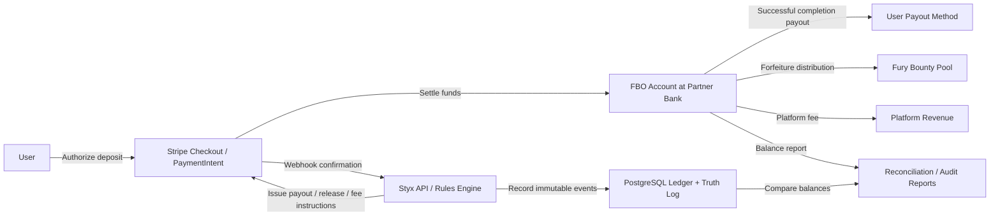

# Legal Artifact Appendices

This document consolidates key artifacts for legal review, including the FBO fund flow diagram, Terms of Service markup mapping, and counsel submission checklists.

## Appendix A: FBO Architecture Diagram

This diagram visualizes the zero-custody / FBO structure described in the parent legal documents. It is designed for counsel review, Stripe risk review, and internal alignment on which entity touches funds and which entity only records or instructs.

### Control Notes

| Flow leg | Operational meaning | Legal significance |
| --- | --- | --- |
| User -> Stripe Checkout / PaymentIntent | User authorizes deposit or hold | Styx does not receive raw card or bank credentials |
| Stripe -> Partner Bank FBO | Funds settle into segregated FBO custody | Supports zero-custody and bank-centric exemption framing |
| Styx API -> Ledger / Truth Log | Styx records the event and state transition | Styx is the control plane, not the custodian |
| Styx API -> Stripe transfer instruction | Styx sends release / payout / fee instruction after verified outcome | Keeps payout logic deterministic and auditable |
| FBO -> User payout method | Funds return directly to user on success or refund trigger | Avoids commingling with Styx operating funds |
| FBO -> Bounty / fee allocation | Forfeited funds and service fees split per published rules | Preserves disclosed allocation logic and auditability |
| Reconciliation loop | Stripe balances compared to internal ledger | Required to prove custody boundaries stay clean over time |

## Appendix B: Terms of Service Markup Notes

This section annotates the current Terms of Service draft with the guardrails it implements. The goal is to make the claim-to-clause relationship explicit before outside review.

| ToS clause | Clause function | Aegis / Recovery source | Why it matters |
| --- | --- | --- | --- |
| `§ 2.1 Styx Is Not Gambling` | Declares deposit-contract framing and user-control theory | Aegis § 2.1-2.2; skill-based whitepaper §§ 1-2 | Preserves the core skill-over-chance positioning |
| `§ 3.1 Age Requirement` | 18+ eligibility promise | Aegis § 3.1 | Supports contract-capacity and youth-protection arguments |
| `§ 3.2 Geographic Restriction` | US-only access + anti-circumvention rule | Aegis § 2.3, § 6; blocklist appendix | Supports any-chance and jurisdiction-risk mitigation |
| `§ 3.3 Identity Verification` | Reserves KYC rights and threshold gating | Real-money brief § 5 | Aligns the ToS with staged financial onboarding |
| `§ 4.5 Settlement` | Defines success, failure, and dispute outcomes | Aegis § 4.2-4.3 | Makes the money path deterministic and reviewable |
| `§ 4.6 Biological / Recovery protocols` | Encodes BMI, velocity, and no-contact safeguards | Aegis § 3.2-3.4; Recovery Protocol | Moves health and anti-isolation controls into contract language |
| `§ 6.1 Escrow Structure` | States FBO segregation and non-commingling | Aegis § 4.1-4.3; Appendix A | Reinforces zero-custody and processor-facing consistency |
| `§ 7 Prohibited Conduct` | Bars fraud, collusion, circumvention, and health-dangerous use | Aegis § 3, § 5 | Gives an enforcement hook for the operational guardrails |
| `§ 10 Limitation of Liability` | Allocates residual health and platform risk | Aegis risk-register links | Does not replace safety controls, but narrows exposure |

### Counsel Review Targets

1. Confirm that `§ 3.2 Geographic Restriction` matches the actual launch-state blocklist and does not overstate enforcement.
2. Confirm that `§ 3.3 Identity Verification` matches the staged KYC thresholds in the real-money brief.
3. Confirm that `§ 4.6` adequately distinguishes Biological guardrails from Recovery guardrails.
4. Confirm that `§ 6.1` and `§ 6.3` align with the actual Stripe Connect / FBO fee split and refund logic.
5. Confirm that liability and arbitration sections do not undermine consumer-protection representations elsewhere in the packet.

## Appendix C: Compliance Checklists

This checklist operationalizes the counsel package. It is ordered to match the likely review flow for outside counsel and processor risk teams.

### Packet Assembly

- [ ] Real-money activation brief included
- [ ] Skill-based contest whitepaper included
- [ ] Aegis Protocol included
- [ ] Gatekeeper compliance memo included
- [ ] Cross-jurisdictional consent matrix included
- [ ] Terms of Service draft included
- [ ] Privacy Policy draft included
- [ ] Regulatory risk register included

### Counsel Questions

- [ ] Confirm skill-based contest classification in target launch states
- [ ] Confirm FBO structure and AOTP framing reduce or eliminate MTL risk
- [ ] Confirm UIGEA exclusion theory for self-competition model
- [ ] Confirm state blocklist is sufficient for launch
- [ ] Confirm KYC tier thresholds
- [ ] Confirm tax reporting obligations
- [ ] Confirm disclosure language for real-money activation

### Processor / App-Store Package Readiness

- [ ] Stripe risk packet includes Appendix A (FBO diagram)
- [ ] App Review note packet includes screenshot mockups
- [ ] Terms markup issues from counsel are back-propagated into `terms-of-service.md`
- [ ] Launch-state decisions are synced back into the state blocklist justification table and main legal docs

### Final Release Gate

- [ ] No unresolved placeholder markers remain in the legal packet
- [ ] Parent docs point to concrete appendix paths
- [ ] Artifact filenames are stable enough for external sharing
